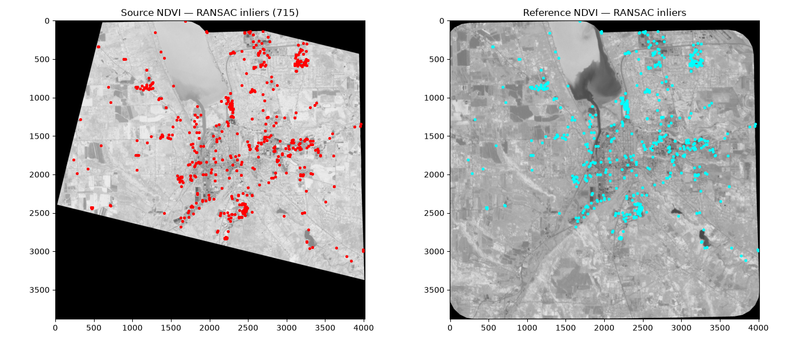
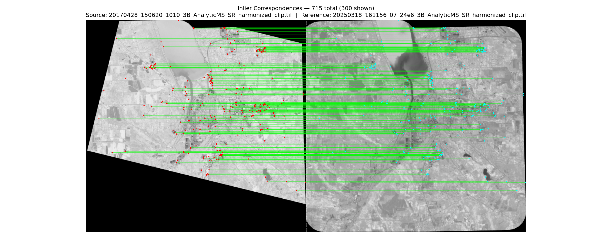

# PlanetScope Registration

Script to georegister [PlanetScope](planet.com) imagery using [OpenCV](https://opencv.org/) and Scale Invariant Feature Transform (SIFT) keypoints and features. 

Two options exist for the script - one using a global affine transform, and one using a local transform with thin plate spline RBF. In both cases matching is done across all 6 pairs of normalized difference indices within the blue, green, red, and NIR color bands (common to all PS imagery). 

In the input spline version, an option exists to downsample keypoints. Keypoints are selectively removed only from image subregions which have more than one keypoint, and retained in regions more sparsely covered. 

This script has been locally tested using proprietary PlanetScope imagery. Will work on uploading a public dataset later on once I find and collate some public Planet data. 

# Example of Keypoint Detection in Two Images

# Example of Matching Across Two Images

# References

Low, D. G. (2004). "Distinctive Image Features from Scale-Invariant Keypoints", *International Journal of Computer Vision* 60 (2). 
 &nbsp;&nbsp;&nbsp;&nbsp;10.1023/B:VISI.0000029664.99615.94
